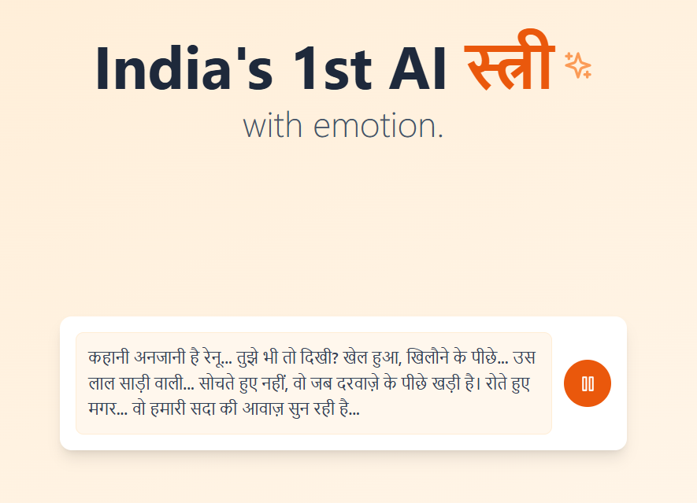

# Stree-1.1A: Hindi Horror Voice Model

<p align="center">

</p>

<p align="center">
<a href="https://huggingface.co/prarabdha21/stree-1.1a"></a>
</p>

Stree-1.1A is a fine-tuned version of the Dia model, specifically optimized for generating Hindi horror voice samples. The model has been trained on a diverse dataset of horror-themed audio samples and can generate various types of horror voices including laughs, whispers, threats, and claims.

## Model Description

- **Base Model:** Dia-1.6B
- **Fine-tuned for:** Hindi Horror Voice Generation
- **Language:** Hindi
- **License:** Apache 2.0

## Features

- Generates horror-themed voice samples in Hindi
- Supports multiple voice categories:
  - Horror laughs
  - Horror whispers
  - Horror threats
  - Horror claims
- Maintains high audio quality and emotional expression
- Optimized for horror genre voice generation

## Installation

```bash
pip install torch transformers numpy soundfile tqdm wandb huggingface_hub
```

## Usage

```python
from dia.model import Dia

# Load the model
model = Dia.from_pretrained("prarabdha21/stree-1.1a")

# Generate horror voice
text = "मैं तुम्हारे साथ हूं..."  # "I am with you..."
audio = model.generate(
    text=text,
    temperature=1.2,
    top_p=0.95,
    cfg_scale=3.0
)

# Save the generated audio
model.save_audio("output.wav", audio)
```

## Training Data

The model was fine-tuned on a custom dataset containing:
- Horror-themed Hindi dialogues
- Various emotional expressions
- Different voice modulations
- Multiple speaking styles

## Hardware Requirements

- GPU with at least 10GB VRAM (recommended)
- CUDA 12.6 or later
- PyTorch 2.0 or later

## Limitations

- Best suited for horror-themed voice generation
- May not perform optimally for non-horror content
- Requires appropriate text prompts for best results

## Citation

If you use this model in your research or project, please cite:

```bibtex
@misc{stree-1.1a,
  author = {Prarabdha},
  title = {Stree-1.1A: Hindi Horror Voice Model},
  year = {2024},
  publisher = {Hugging Face},
  journal = {Hugging Face Hub},
  howpublished = {\url{https://huggingface.co/prarabdha21/stree-1.1a}}
}
```

## License

This model is released under the Apache License 2.0. See the [LICENSE](LICENSE) file for more details.

## Disclaimer

This project offers a high-fidelity speech generation model intended for research and educational use. The following uses are **strictly forbidden**:

- **Identity Misuse**: Do not produce audio resembling real individuals without permission.
- **Deceptive Content**: Do not use this model to generate misleading content (e.g. fake news)
- **Illegal or Malicious Use**: Do not use this model for activities that are illegal or intended to cause harm.

By using this model, you agree to uphold relevant legal standards and ethical responsibilities. We **are not responsible** for any misuse and firmly oppose any unethical usage of this technology.
